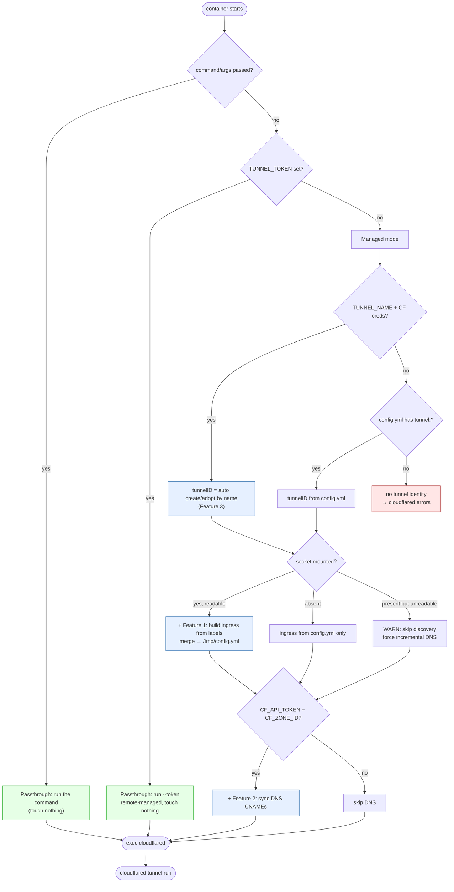

# cloudflared-wrapped

A drop-in replacement for the official [cloudflared](https://github.com/cloudflare/cloudflared) Docker image that:

- Auto-creates (or adopts) the tunnel itself from a name — no manual `cloudflared tunnel create`, no `cert.pem` to mount.
- Auto-manages Cloudflare DNS records from your tunnel's `config.yml`. CNAMEs are created if missing and repointed if they exist but target the wrong tunnel.
- Discovers ingress from Docker container labels, so a service's public endpoint lives next to the service.

With the official image, standing up a new tunnel means running `cloudflared tunnel login`, `cloudflared tunnel create`, copying out a `credentials.json`, and then maintaining DNS records by hand. This image removes all of that — set an API token and a tunnel name and the rest is done on container start.

## Drop-in compatibility

Every extra feature is opt-in, gated by its own input. With none of them set the
image is a **true drop-in** for the official one (it even runs as the same
nonroot uid `65532`):

- Pass a **command** (e.g. `command: tunnel run --token …`) → forwarded to
  cloudflared untouched; the wrapper does nothing.
- Set **`TUNNEL_TOKEN`** → runs the remote-managed tunnel as-is, untouched.
- Mount a **`config.yml`** with `tunnel:` + `credentials-file:` → runs exactly
  like the official image, with our features layered on only if you add them.

An explicit command or `TUNNEL_TOKEN` always wins over the wrapper's own tunnel
logic. So you can swap `cloudflare/cloudflared` for this image with **no other
changes** and it just works; the automation only kicks in when you ask for it.

## How it works

On start, with credentials configured, the wrapper:

1. **Ensures the tunnel exists.** If `credentials.json` is on disk it's reused. Otherwise the wrapper looks the tunnel up by name via the Cloudflare API; an existing tunnel is adopted (its secret reconstructed from the `/token` endpoint), a missing one is created with a freshly generated secret. The resulting `credentials.json` is written to the data dir so subsequent restarts skip the API entirely.
2. **Syncs DNS.** Parses `config.yml`, extracts every `hostname:` from ingress, and reconciles the corresponding CNAMEs in your zone:
   - Missing → created.
   - Already pointing at this tunnel → left alone.
   - Pointing at something else → repointed (logged as `Update  host from X to Y`).
   - In `complete` mode, CNAMEs pointing at this tunnel that are **not** in config are also deleted.
3. **Execs cloudflared.** Replaces itself with `cloudflared tunnel run <uuid>` — cloudflared becomes PID 1 and receives signals directly. The tunnel UUID is passed on the CLI, so `config.yml` does not need a `tunnel:` field.

Tunnel-ensure and DNS-sync failures are logged as warnings but never prevent the tunnel from starting (when the data dir already holds a valid `credentials.json`).

## Activation model

Every feature is opt-in, gated by its own input. An explicit command or
`TUNNEL_TOKEN` short-circuits everything (true drop-in); otherwise the wrapper
identifies the tunnel, then layers label discovery and DNS sync on top —
independently of how the tunnel was identified.



| Feature | Activates when | Needs |
|---|---|---|
| 0 — Passthrough | always the baseline | nothing |
| 1 — Discover ingress from labels | Docker socket mounted | socket only |
| 2 — Manage DNS | `CF_API_TOKEN` + `CF_ZONE_ID` set | Cloudflare API creds |
| 3 — Auto-create/adopt tunnel | `TUNNEL_NAME` + token + account set | API creds + name |

## Image

- Based on `gcr.io/distroless/static` — no shell, no package manager, same security posture as the official cloudflared image
- Contains two static binaries: `cloudflared` (copied from official) and `cloudflared-wrapped` (the Go sync + entrypoint)
- ~70 MB vs ~103 MB for the official image

## Quick start

### 1. Gather your IDs

From the Cloudflare dashboard you need:

- **Account ID** — right sidebar of any zone, or Account Home.
- **Zone ID** — right sidebar of the zone containing your ingress hostnames.

### 2. Create an API token

Go to [API Tokens](https://dash.cloudflare.com/profile/api-tokens) and create a token with:

- **Zone → DNS → Edit** on the zone(s) your hostnames live in
- **Account → Cloudflare Tunnel → Edit** on your account

The Tunnel scope is only needed for the auto-create/adopt path. If you'd rather manage the tunnel yourself, omit it (see [Manual tunnel](#manual-tunnel) below).

### 3. Write config.yml

```yaml
ingress:
  - hostname: app.example.com
    service: http://host.docker.internal:8080
  - hostname: grafana.example.com
    service: http://host.docker.internal:3000
  - service: http_status:404
```

No `tunnel:` or `credentials-file:` — the wrapper supplies both at runtime. The catch-all `http_status:404` at the end is required by cloudflared.

### 4. Run it

```yaml
# docker-compose.yml
services:
  cloudflared:
    image: ghcr.io/miista/cloudflared-wrapper:latest
    container_name: cloudflared
    restart: unless-stopped
    environment:
      - TUNNEL_NAME=my-tunnel
      - CF_ACCOUNT_ID=${CF_ACCOUNT_ID}
      - CF_ZONE_ID=${CF_ZONE_ID}
      - CF_API_TOKEN=${CF_API_TOKEN}
    volumes:
      - ./cloudflared:/etc/cloudflared:ro          # your config.yml, read-only
      - cloudflared-creds:/var/lib/cloudflared      # wrapper-owned, no chown needed
    extra_hosts:
      - host.docker.internal:host-gateway

volumes:
  cloudflared-creds:
```

The config bind mount is **read-only** — you edit `config.yml` on the host as your normal user, no chown gymnastics. The `credentials.json` lives in a Docker-managed named volume that the container owns; the image pre-creates `/var/lib/cloudflared` with the right ownership so the volume inherits it on first start.

```bash
docker compose up -d cloudflared
```

On first start (tunnel doesn't exist yet):
```
[tunnel] Creating new tunnel name=my-tunnel
[tunnel] Created tunnel id=abc123...
[sync] tunnel=abc123... mode=incremental hostnames=2
  Create  app.example.com
  Create  grafana.example.com
[sync] Summary: ok=0 created=2 updated=0 deleted=0 errors=0
[sync] DNS sync OK in 340ms
[entrypoint] Launching cloudflared tunnel
```

On subsequent starts, `credentials.json` is reused and existing records are left alone:
```
[tunnel] Using existing credentials.json tunnel=abc123...
[sync] tunnel=abc123... mode=incremental hostnames=2
  OK      app.example.com
  OK      grafana.example.com
[sync] Summary: ok=2 created=0 updated=0 deleted=0 errors=0
[sync] DNS sync OK in 120ms
[entrypoint] Launching cloudflared tunnel
```

If `credentials.json` is missing but a tunnel with that name already exists in Cloudflare (e.g. fresh volume, same account), the wrapper adopts it:
```
[tunnel] Adopting existing tunnel name=my-tunnel id=abc123...
```

If a CNAME for one of your hostnames exists but points at a different tunnel, it's repointed:
```
  Update  app.example.com from old-uuid.cfargotunnel.com to abc123.cfargotunnel.com
```

## Discovering ingress from container labels

Instead of (or alongside) hand-writing ingress rules in `config.yml`, a service
can declare its own public endpoint with a Docker label — the tunnel config
then lives next to the service it exposes.

Mount the Docker socket read-only and add one label to the service:

```yaml
services:
  cloudflared:
    image: ghcr.io/miista/cloudflared-wrapper:latest
    environment:
      - TUNNEL_NAME=my-tunnel
      - CF_ACCOUNT_ID=${CF_ACCOUNT_ID}
      - CF_ZONE_ID=${CF_ZONE_ID}
      - CF_API_TOKEN=${CF_API_TOKEN}
    volumes:
      - cloudflared-creds:/var/lib/cloudflared
      - /var/run/docker.sock:/var/run/docker.sock:ro   # enables label discovery
    group_add:
      - "999"   # ← the host's docker group GID; see note below

  app:
    image: my-app:latest
    labels:
      cloudflare.io/hostname: "app.example.com"
```

On start the wrapper reads container labels over the socket, generates ingress
rules, and (if `CF_API_TOKEN` is set) creates the matching DNS records — exactly
as for hand-written ingress. With auto tunnel (`TUNNEL_NAME`) you don't even need
a `config.yml`: ingress is synthesized from labels plus a catch-all.

> **Socket permissions.** The image runs as nonroot (uid `65532`, same as the
> official image), so it cannot read the root-owned Docker socket without being
> added to the socket's group. Find the GID on the host with
> `stat -c '%g' /var/run/docker.sock` and put it in `group_add`. This is the
> only setup cost of label discovery, and it's paid only by containers that
> mount the socket — base usage needs none of it.

### Two independent features

| Feature | Activates when | Needs |
|---|---|---|
| Discover ingress from labels | Docker socket is mounted | socket only |
| Manage DNS | `CF_API_TOKEN` (+ zone/account) set | Cloudflare API creds |

They compose: socket only → label-based routing with hand-managed DNS; token
only → today's behavior; both → fully automatic; neither → identical to the
official cloudflared image.

### The service target is inferred

The container declaring the label *is* the backend, so only the hostname is
required. The wrapper builds the target as `http://<container-name>:<port>`:

- **Port** — inferred from the container's single exposed port. If the container
  exposes **zero or more than one** port, inference is ambiguous: specify the
  port in the label as `cloudflare.io/hostname: "app.example.com:8080"`. The
  `:8080` is the *backend* port, not the public one (public is always 443 via
  the tunnel). A container that can't be resolved is skipped with a loud log —
  it never aborts the tunnel.
- **Scheme** — always `http://` (the tunnel terminates TLS at the edge). For an
  `https`/`tcp`/`ssh` backend, write that rule by hand in `config.yml` instead.
- **Disable** — comment out the label.

### Supported labels

| Label | Description | Default |
|---|---|---|
| `cloudflare.io/hostname` | Public hostname; presence enables ingress. Optional `:port` suffix sets the backend port. | — |

### Merge rules

Label-discovered rules are merged with any manual ingress in `config.yml`:

- Manual hostname rules come first, then discovered rules, then a single
  `http_status:404` catch-all (added automatically if absent).
- On a hostname collision, the **manual** entry wins and the label is skipped.
- The merged config is written to `/tmp/config.yml` (regenerated on every
  start), leaving your read-only `config.yml` untouched. Nothing extra to mount
  or configure for this.

> Like all label changes, the new ingress is picked up at startup. After adding
> or changing a `cloudflare.io/*` label, `docker restart cloudflared`.

### `complete` mode safety

In `complete` mode, a CNAME for a hostname whose container has been stopped or
removed is deleted (the hostname leaves the desired set). As a guardrail, if the
socket is mounted but unreadable, the wrapper downgrades to `incremental` for
that run rather than deleting records against an incomplete desired set. A socket
that simply isn't mounted is treated as opting out of discovery, and `complete`
runs normally against the manual `config.yml` entries.

## Adding a new service

1. Add an ingress entry to `config.yml` **or** a `cloudflare.io/hostname` label
   to the service
2. `docker compose restart cloudflared`

That's it. The DNS record is created automatically.

## Removing a service

In the default `incremental` mode, removing a hostname from `config.yml` does **not** delete the DNS record — it's left in place as a safe default.

To also clean up stale DNS records, use `complete` mode:

```bash
CF_SYNC_MODE=complete docker compose up -d --force-recreate cloudflared
```

This deletes any CNAME pointing at your tunnel that isn't in config. Think of it as the difference between an incremental and a full deployment.

## Manual tunnel

If you'd rather create and own the tunnel yourself (e.g. you don't want to grant the `Cloudflare Tunnel:Edit` scope, or you manage tunnels via Terraform), omit `TUNNEL_NAME` and place a pre-existing `credentials.json` in the data dir. Add `tunnel:` and `credentials-file:` to your `config.yml`:

```yaml
tunnel: <your-tunnel-uuid>
credentials-file: /etc/cloudflared/credentials.json
ingress:
  - hostname: app.example.com
    service: http://host.docker.internal:8080
  - service: http_status:404
```

DNS sync still works as long as `CF_API_TOKEN` and `CF_ZONE_ID` are set. The volume can be read-only in this mode.

## Environment variables

| Variable | Required | Default | Description |
|---|---|---|---|
| `TUNNEL_TOKEN` | No | — | Remote-managed tunnel token. If set (or a command is passed to the container), the wrapper forwards straight to cloudflared and skips all of its own logic — a true drop-in. |
| `TUNNEL_NAME` | No | — | If set (with `CF_API_TOKEN` and `CF_ACCOUNT_ID`), the wrapper ensures a tunnel with this name exists and writes `credentials.json`. |
| `CF_API_TOKEN` | No | — | Cloudflare API token. Needs Zone:DNS:Edit for DNS sync; add Account:Cloudflare Tunnel:Edit for auto tunnel ensure. |
| `CF_ACCOUNT_ID` | No | — | Cloudflare account ID. Required when `TUNNEL_NAME` is set. |
| `CF_ZONE_ID` | No | — | Cloudflare zone ID. If unset, DNS sync is skipped. |
| `MODE` | No | `incremental` | `incremental` or `complete` |
| `CONFIG_PATH` | No | `/etc/cloudflared/config.yml` | Path to the tunnel config file |
| `CREDENTIALS_DIR` | No | `/var/lib/cloudflared` | Directory where `credentials.json` is read/written. Defaults to the writable dir the image pre-creates (owned by uid `65532`), so it normally needs no override. |

Without any Cloudflare credentials, the image behaves identically to the official cloudflared image.

## Mounts

| Path | Description |
|---|---|
| `/etc/cloudflared/config.yml` | Tunnel config — `ingress:` rules. With manual tunnel, also `tunnel:` + `credentials-file:`. Mount read-only. |
| `/var/lib/cloudflared/credentials.json` | Tunnel credentials. In auto mode, written by the wrapper at this location (the default `CREDENTIALS_DIR`). Pre-created in the image owned by uid `65532` so a named volume mounted here inherits the right perms. |

### Inspecting the credentials volume

```bash
docker run --rm -v cloudflared-creds:/c alpine cat /c/credentials.json
```

### Forcing a fresh adopt/create

```bash
docker compose down
docker volume rm <project>_cloudflared-creds
docker compose up -d
```

### Bind mount for credentials (alternative)

If you'd rather keep `credentials.json` on the host filesystem, bind-mount the dir instead of using a named volume — but you'll need to make it writable by uid `65532`:

```bash
sudo chown -R $USER:65532 ./cloudflared-creds
sudo chmod -R 775 ./cloudflared-creds
sudo chmod g+s ./cloudflared-creds
```

## Automated builds

A GitHub Actions workflow checks for new cloudflared releases daily. When a new version is detected, the image is rebuilt and pushed with both a version tag and `latest`.

## License

Apache 2.0 — same as cloudflared.
